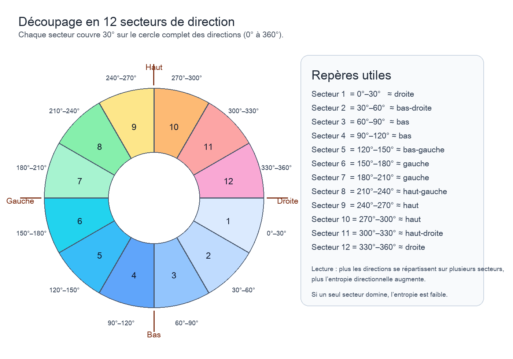

## Analyse multimodale

Dans une approche longitudinale, l'entropie d'un mot est une mesure descriptive de sa répartition entre plusieurs entretiens. Elle indique si ce mot est concentré sur certains moments précis du suivi ou, au contraire, s'il est présent de manière plus régulière dans l'ensemble des entretiens. Une entropie faible signifie que le mot est surtout associé à un nombre limité d'entretiens. Une entropie élevée signifie qu'il est plus diffus et plus régulièrement distribué dans le temps.

Dans une approche longitudinale, la variance d'un mot est une mesure descriptive de l'ampleur de ses variations de fréquence d'un entretien à l'autre. Elle indique si l'usage de ce mot reste relativement stable au cours du suivi ou s'il connaît au contraire de fortes fluctuations autour de son niveau moyen. Une variance faible signifie que la fréquence du mot change peu entre les entretiens. Une variance élevée signifie que son usage varie fortement dans le temps.

Cette aide décrit les principaux indicateurs affichés dans l'onglet `Analyse multimodale`, en particulier dans `Analyse mouvements`.

Important :
- l'interface sous les vignettes ne montre qu'une **sélection réduite** d'indicateurs pour rester lisible
- d'autres indicateurs restent toutefois analytiquement importants et peuvent être présents dans les tableaux, les exports et cette aide
- cette aide décrit à la fois les indicateurs visibles sous les images et certains indicateurs plus détaillés conservés dans les exports

Ces indicateurs décrivent des **variations visuelles entre deux images successives**.  
Ils ne constituent pas, à eux seuls, une interprétation clinique ni un diagnostic.

L'idée générale est simple :
- une image `t` est comparée à l'image `t+1`
- on mesure ce qui bouge, où cela bouge, dans quelle direction, et avec quelle intensité

## Principe général

L'analyse des mouvements repose principalement sur l'**optical flow** :
- il s'agit d'une estimation du déplacement apparent des pixels entre deux images successives
- plus le déplacement est fort, plus la scène change visuellement

L'application produit ensuite plusieurs vues :
- `Images brutes`
- `Magnitude`
- `HSV`
- `Vecteurs`
- `Superposition`

## Comment est composé le fichier segments de texte CSV

Dans le fichier d'alignement des segments de texte, chaque ligne repose sur une logique de synchronisation commune.

Donc maintenant, pour chaque ligne :
- `timestamp_sync = (start_sec + end_sec) / 2`
- l'image synchronisée = l'image la plus proche de ce centre
- `anomalie_audio_sync = oui/non` selon qu'il y a une anomalie audio à ce même timestamp

Autrement dit :
- le segment de texte garde son intervalle `start_sec -> end_sec`
- mais la synchronisation multimodale se fait à partir du **centre temporel du segment**
- c'est ce centre qui sert à rapprocher le texte, l'image et l'indicateur audio

## Indicateurs affichés sous les images

Sous chaque vignette, l'interface affiche maintenant une sélection resserrée d'indicateurs.

### Toujours affichés

- `Mode anatomique`
- `Backend ROI`
- `Optical flow moyen`
- `Magnitude p95`
- `Direction`

### Affichés en mode visage

- `Visages`
- `Flow moyen visage`
- `Ratio actif visage`
- `Énergie visage`
- `Entropie directionnelle`
- `Ouverture bouche`
- `Ouverture oeil gauche`
- `Ouverture oeil droit`
- `Asymétrie G/D`
- `Énergie bouche`
- `Énergie yeux`
- `Énergie sourcils`

### Affichés en mode corps_entier

- `Flow moyen corps`
- `Ratio actif corps`
- `Énergie corps`
- `Entropie directionnelle`
- `Déplacement centre corps`
- `Énergie tête`
- `Énergie torse`
- `Énergie bras gauche`
- `Énergie bras droit`

## Comment lire les indicateurs de mouvement

### Optical flow moyen

`Optical flow moyen` mesure l'intensité moyenne du déplacement entre deux images.

Lecture simple :
- valeur faible = peu de changement visuel
- valeur élevée = changement visuel plus important

Cela peut correspondre à :
- un mouvement du corps
- un geste localisé
- un changement de cadrage
- un objet qui traverse l'image

### Magnitude p95

`Magnitude p95` mesure un pic de mouvement robuste.

La `magnitude`, dans l'optical flow, correspond à l'**intensité du déplacement d'un pixel entre deux images successives**.

Ce n'est pas la moyenne globale, mais une estimation des zones les plus mobiles de l'image.

Lecture simple :
- si cette valeur est bien plus élevée que l'`Optical flow moyen`, cela signifie qu'une partie de l'image bouge beaucoup plus que le reste

### Norme vecteur

`Norme vecteur` mesure l'intensité du vecteur moyen global de déplacement.

Lecture simple :
- plus la valeur est élevée, plus le mouvement moyen a une direction nette et marquée

### Angle vecteur

`Angle vecteur` donne l'orientation du mouvement moyen.

Cette valeur est surtout utile avec `Direction`.

### Direction

`Direction` est une lecture qualitative du vecteur moyen :
- `droite`
- `gauche`
- `haut`
- `bas`
- `stable`

Lecture simple :
- cela résume la direction dominante du déplacement visuel

Attention :
- cela ne veut pas forcément dire que "le patient va à droite"
- cela peut venir d'un geste, d'un changement de posture, d'un déplacement d'objet, ou d'un mouvement de caméra

### Hotspot X / Hotspot Y

`Hotspot X` et `Hotspot Y` indiquent la zone la plus mobile dans l'image.

Ce sont des coordonnées **normalisées** entre `0` et `1`.

Lecture simple :
- `Hotspot X = 0` = côté gauche
- `Hotspot X = 1` = côté droit
- `Hotspot Y = 0` = haut
- `Hotspot Y = 1` = bas

Exemple :
- `Hotspot X = 1.000`
- `Hotspot Y = 0.941`

signifie que la zone la plus mobile est située **en bas à droite** de l'image.

## Comment lire les indicateurs HSV et couleur

### HSV teinte (H)

`HSV teinte (H)` correspond à la teinte moyenne dominante de l'image.

Seule, cette valeur est peu interprétable cliniquement.  
Elle est surtout utile pour décrire des variations globales d'ambiance visuelle.

### HSV valeur (V)

`HSV valeur (V)` correspond à la luminosité moyenne de l'image.

Lecture simple :
- valeur élevée = image plus claire
- valeur faible = image plus sombre

### HSV saturation (S)

`HSV saturation (S)` correspond à l'intensité colorée moyenne.

Lecture simple :
- valeur élevée = couleurs plus vives
- valeur faible = image plus terne ou plus grisâtre

## Détection faciale

### Visages

`Visages` indique le nombre de visages détectés dans l'image.

Exemple :
- `Visages = 0` signifie qu'aucun visage n'a été détecté

Cela ne veut pas dire qu'il n'y a personne dans la scène ; cela signifie seulement que le détecteur n'a pas reconnu de visage exploitable.

## Vue annotée et analyse anatomique

L'onglet `Annotée` ajoute une couche d'analyse sur la zone d'intérêt choisie :
- `visage`
- `corps_entier`

Le pipeline conserve les quatre vues optiques classiques (`Magnitude`, `HSV`, `Vecteurs`, `Superposition`) puis ajoute une lecture anatomique locale.

### Qu'est-ce que la ROI ?

`ROI` veut dire `Region Of Interest`, c'est-à-dire **zone d'intérêt**.

Dans cette analyse, la ROI correspond à la partie de l'image sur laquelle on concentre les calculs anatomiques.

Exemples :
- en mode `visage`, la ROI est la zone du visage détecté
- en mode `corps_entier`, la ROI est la zone du corps détecté

Pourquoi c'est utile :
- cela évite de mélanger le mouvement du sujet avec tout le reste de l'image
- cela permet de calculer des indicateurs locaux plus précis
- cela rend l'analyse plus cohérente quand on veut comparer bouche, yeux, sourcils, tête, torse ou bras

Important :
- si aucune ROI exploitable n'est détectée, les indicateurs locaux peuvent rester nuls
- dans ce cas, les vues globales (`Magnitude`, `HSV`, `Vecteurs`, `Superposition`) restent malgré tout interprétables

### Backend ROI

`Backend ROI` indique quel moteur a effectivement servi à définir la zone d'intérêt.

Exemple :
- `opencv_face_bbox`

signifie que la ROI visage a été obtenue par un détecteur OpenCV sous forme de boîte englobante.

Cette valeur est importante parce qu'elle rappelle que l'analyse anatomique dépend d'un détecteur préalable.  
Si ce détecteur ne trouve rien, les métriques locales peuvent rester nulles.

### Choix du backend anatomique

Dans l'onglet `Analyse mouvements`, il est possible de choisir entre :
- `OpenCV`
- `MediaPipe`

#### OpenCV

`OpenCV` est utile quand on veut :
- une détection simple et rapide
- une ROI robuste même sur des images imparfaites
- un fallback léger quand la finesse anatomique n'est pas l'objectif principal

En pratique, OpenCV repère surtout des boîtes englobantes :
- visage
- corps entier

La lecture anatomique est donc plus grossière, mais souvent plus stable.

#### MediaPipe

`MediaPipe` est utile quand on veut :
- des landmarks plus fins
- une meilleure décomposition locale du visage
- une lecture plus détaillée du corps, des sous-zones et des articulations

En pratique, MediaPipe permet une analyse anatomique plus riche :
- contour du visage
- bouche
- yeux
- sourcils
- squelette corporel

Cette solution est souvent plus pertinente si l'objectif est de comparer des micro-variations locales.

#### Différence pratique

On peut résumer ainsi :
- `OpenCV` = plus léger, plus robuste, plus simple
- `MediaPipe` = plus fin, plus anatomique, plus exigeant

Autrement dit :
- `OpenCV` garantit plus facilement que l'analyse tourne
- `MediaPipe` apporte une meilleure finesse descriptive quand la détection fonctionne bien

Les valeurs possibles de `Backend ROI` peuvent par exemple être :
- `opencv_face_bbox`
- `hog_person_detector`
- `mediapipe_face_mesh`
- `mediapipe_pose`

## Indicateurs ROI généraux

Ces indicateurs décrivent la zone anatomique retenue, qu'il s'agisse du visage ou du corps.

### Centre ROI X / Centre ROI Y

`Centre ROI X` et `Centre ROI Y` donnent la position normalisée du centre de la ROI.

Lecture simple :
- `X = 0` = très à gauche
- `X = 1` = très à droite
- `Y = 0` = très en haut
- `Y = 1` = très en bas

Si les deux sont à `0.000`, cela signifie souvent que la ROI n'a pas été trouvée.

### Flow moyen ROI

`Flow moyen ROI` mesure le déplacement moyen uniquement dans la zone anatomique.

Lecture simple :
- valeur élevée = la zone retenue bouge visiblement
- valeur faible = peu de mouvement local dans cette zone

### Flow écart-type ROI

`Flow écart-type ROI` mesure l'hétérogénéité du mouvement dans la ROI.

Lecture simple :
- faible = mouvement plus homogène
- élevé = certaines parties bougent beaucoup plus que d'autres

### Flow max ROI

`Flow max ROI` mesure la plus forte magnitude observée dans la ROI.

Lecture simple :
- permet de repérer un pic local très fort, même si la moyenne reste modérée

### Ratio actif ROI

`Ratio actif ROI` indique la proportion de pixels de la ROI considérés comme réellement en mouvement.

Lecture simple :
- proche de `0` = très peu de pixels actifs
- plus élevé = une plus grande part de la zone est engagée dans le mouvement

### Énergie ROI

`Énergie ROI` résume l'intensité du mouvement local en tenant compte de la magnitude au carré.

Lecture simple :
- plus cette valeur est élevée, plus le mouvement dans la ROI est fort

### Cohérence directionnelle

`Cohérence directionnelle` mesure si les vecteurs de flow pointent globalement dans la même direction.

Lecture simple :
- proche de `1` = mouvement local cohérent
- proche de `0` = mouvement dispersé ou désordonné

### Entropie directionnelle

`Entropie directionnelle` mesure la dispersion des directions du mouvement.

L'entropie directionnelle est une manière de mesurer à quel point les directions du mouvement sont ordonnées ou dispersées dans un champ d'optical flow.

Dans l'optical flow, chaque pixel mobile possède un vecteur de déplacement. Ce vecteur a une intensité, que l'on appelle souvent `magnitude`, et une direction, que l'on note par un angle. L'entropie directionnelle ne regarde donc pas d'abord « combien ça bouge », mais « dans combien de directions différentes ça bouge » et avec quel degré de dispersion.

Pour l'affichage dans l'application, le cercle complet des directions (`0°` à `360°`) est découpé en `12 secteurs de direction` de `30°` chacun :
- `secteur 1` = `0°-30°`
- `secteur 2` = `30°-60°`
- `secteur 3` = `60°-90°`
- `secteur 4` = `90°-120°`
- `secteur 5` = `120°-150°`
- `secteur 6` = `150°-180°`
- `secteur 7` = `180°-210°`
- `secteur 8` = `210°-240°`
- `secteur 9` = `240°-270°`
- `secteur 10` = `270°-300°`
- `secteur 11` = `300°-330°`
- `secteur 12` = `330°-360°`

Repères simples :
- `secteur 1` ≈ droite
- `secteur 4` ≈ bas
- `secteur 7` ≈ gauche
- `secteur 10` ≈ haut

L'idée est simple :
- si, dans une zone donnée, presque tous les vecteurs pointent dans la même direction, le mouvement est très organisé
- dans ce cas, l'entropie directionnelle est faible
- à l'inverse, si les vecteurs partent dans de nombreuses directions différentes, le mouvement est plus désordonné ou plus complexe
- dans ce cas, l'entropie directionnelle est élevée

Comment lire le score affiché dans l'application :
- `0` = presque tout le mouvement va dans une seule direction
- `3.585` = maximum théorique avec `12 secteurs`
- ce maximum vient simplement du fait que l'on a découpé le cercle en `12` directions possibles
- `3.585` ne décrit donc pas un mouvement réel particulier ; c'est seulement la borne haute de comparaison

Autrement dit :
- un score proche de `0` = mouvement très concentré
- un score proche de `3.585` = mouvement réparti dans presque toutes les directions

Exemple :
- `Score : 0.339 sur 3.585`
- cela signifie que le mouvement est très peu dispersé
- il va surtout dans une direction dominante, et non dans toutes les directions

Lecture simple :
- faible = directions regroupées
- élevée = directions variées

En pratique :
- cohérence forte + entropie faible = mouvement local plus unifié
- cohérence faible + entropie élevée = mouvement plus désorganisé

### Divergence abs.

`Divergence abs.` décrit l'intensité moyenne des variations locales d'expansion ou de contraction du champ de mouvement.

Lecture simple :
- valeur élevée = variations locales plus marquées du flux

### Rotationnel abs.

`Rotationnel abs.` décrit l'intensité moyenne des composantes tournantes du champ de mouvement.

Lecture simple :
- valeur élevée = mouvement local plus tourbillonnant ou plus circulaire

### Dérivée énergie

`Dérivée énergie` compare l'énergie de la ROI à celle de l'image précédente.

Lecture simple :
- positive = montée de l'activité
- négative = baisse de l'activité

### Pic d'activité

`Pic d'activité` indique si l'image courante a été repérée comme pic local simple d'activité.

Lecture simple :
- `oui` = point haut local
- `non` = pas de pic particulier à cette image

## Indicateurs spécifiques au mode visage

Ces indicateurs n'ont de sens que si un visage a été détecté.

### Ouverture bouche

`Ouverture bouche` est un indicateur simple de l'ouverture verticale estimée de la bouche, rapportée à la taille du visage.

Lecture simple :
- valeur plus élevée = bouche plus ouverte

### Ouverture oeil gauche / Ouverture oeil droit

Ces valeurs estiment l'ouverture verticale de chaque oeil, rapportée à la taille du visage.

Lecture simple :
- plus élevé = oeil plus ouvert
- très faible = oeil plus fermé ou détection incertaine

### Asymétrie G/D

`Asymétrie G/D` mesure l'écart entre l'ouverture estimée de l'oeil gauche et de l'oeil droit.

Lecture simple :
- faible = symétrie relative
- élevée = dissymétrie plus marquée ou détection instable

### Énergie bouche

`Énergie bouche` mesure l'énergie du mouvement limitée à la sous-zone bouche.

### Énergie yeux

`Énergie yeux` mesure l'énergie moyenne du mouvement dans les deux sous-zones yeux.

### Énergie sourcils

`Énergie sourcils` mesure l'énergie moyenne du mouvement dans les sous-zones sourcils.

Lecture générale :
- ces trois valeurs servent à comparer quelles parties du visage sont les plus actives entre deux images successives

## Quand toutes les valeurs ROI sont à zéro

Si tu vois par exemple :
- `Visages = 0`
- `Flow moyen ROI = 0`
- `Ouverture bouche = 0`
- `Énergie bouche = 0`

cela signifie en général que le pipeline n'a pas trouvé de ROI exploitable dans cette image pour le mode demandé.

Dans ce cas :
- les vues optiques globales (`Magnitude`, `HSV`, `Vecteurs`, `Superposition`) restent valides
- mais la couche anatomique locale n'a pas pu être calculée

Donc ce n'est pas un “résultat psychologique nul” ; c'est surtout :
- une absence de détection locale fiable
- ou une image peu adaptée au détecteur

## Lecture de ton exemple

Exemple :
- `Mode anatomique = visage`
- `Backend ROI = opencv_face_bbox`
- `Visages = 0`
- toutes les métriques ROI à `0.000`

Lecture probable :
- le mode demandé était bien `visage`
- le backend prévu est un détecteur OpenCV de boîte visage
- mais sur cette image précise, aucun visage exploitable n'a été reconnu
- donc toute la couche ROI visage reste nulle

En revanche, les indicateurs globaux restent lisibles :
- `Optical flow moyen = 7.605` = il y a bien du mouvement dans l'image
- `Magnitude p95 = 34.496` = certaines zones bougent fortement
- `Direction = haut` = le mouvement dominant va vers le haut
- `Hotspot X = 0.097` et `Hotspot Y = 0.824` = la zone la plus active est plutôt en bas à gauche

## Lecture synthétique d'un exemple

Exemple :
- `flow 10.745`
- `pic 30.590`
- `direction droite`

Lecture possible :
- le mouvement global est assez marqué
- certaines zones bougent beaucoup plus que la moyenne
- le déplacement dominant va vers la droite

Si on ajoute :
- `Hotspot X = 1.000`
- `Hotspot Y = 0.941`

on peut dire que :
- la zone la plus mobile se situe en bas à droite de l'image

Mais on ne peut pas conclure directement :
- à un état interne
- à une intention
- ni à une signification clinique unique

## Interprétation prudente

Ces indicateurs doivent être lus comme des **descriptions de dynamique visuelle** :
- intensité du changement
- direction dominante
- localisation du mouvement
- ambiance colorimétrique

Il faut rester prudent sur l’interprétation : l’optical flow mesure d’abord un mouvement apparent entre deux images, pas directement un “état psychique” ni même toujours un mouvement corporel réel, car il peut aussi réagir aux variations d’éclairage, aux ombres, au bruit vidéo ou au mouvement de caméra.

Ils peuvent ensuite être mis en relation avec :
- les segments de texte
- les silences et les anomalies audio
- le contexte clinique ou interactionnel

La bonne lecture est donc :
- **outil de repérage**
- pas **preuve automatique**
- pas **jugement clinique automatique**

## Intérêt en sciences humaines

Dans une logique multimodale inspirée par Bateson, ces mesures peuvent servir à repérer :
- des moments de rupture
- des contradictions entre verbal et non-verbal
- des déplacements brusques du cadre interactionnel
- des zones de tension visuelle associées à un segment de texte

Leur intérêt est maximal quand elles sont lues avec :
- les segments horodatés
- les anomalies audio
- et la séquence d'images synchronisée
