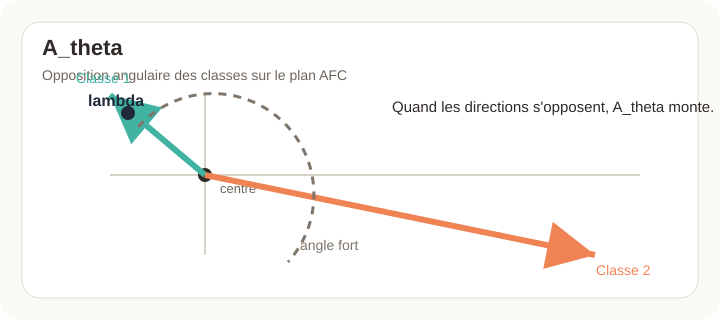
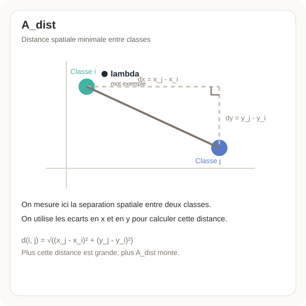
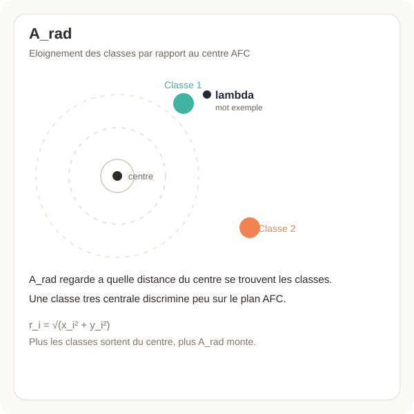
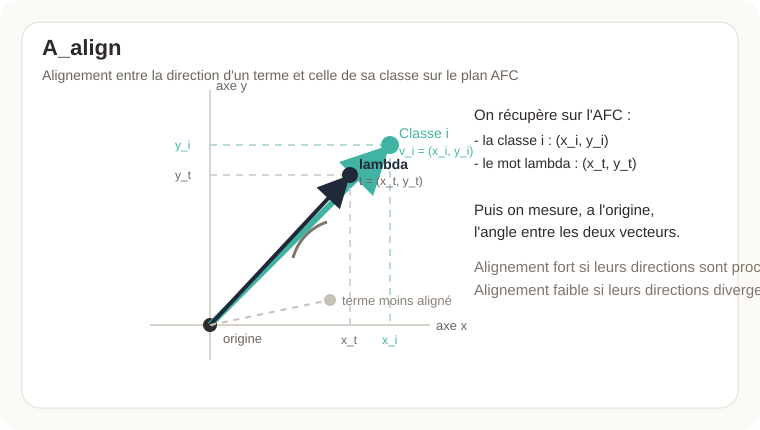
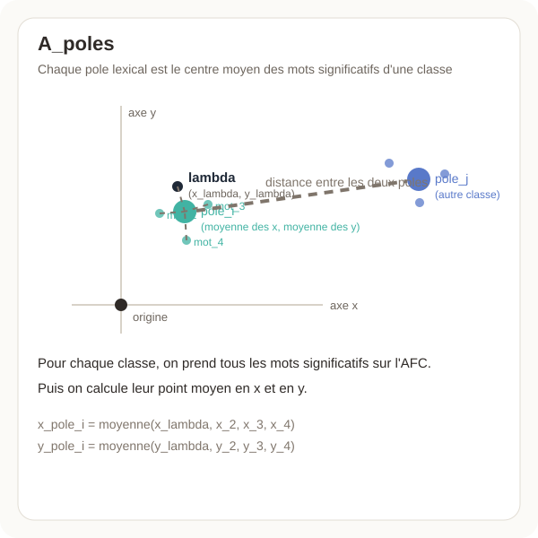

# Analyse discriminante optimisée

## Objectif

Dans cette version, le mode **Analyse discriminante optimisée** ne teste plus une grande grille exhaustive.

Il cherche un résultat plus discriminant avec une stratégie ciblée :

- `k_iramuteq` fixe le **plafond de classes exploré** ;
- la **borne minimale d'exploration** est interne au mode et fixée à `3` classes ;
- le **filtrage morphosyntaxique** est forcé sur `NOM + VER` ;
- le verbe `être` est exclu ;
- `min_docfreq` est la variable testée automatiquement, de `2` à `5`.

Le but est d'obtenir plus vite un résultat où les classes s'opposent nettement sur l'AFC.

## Bornes d'exploration

Dans ce mode, l'utilisateur **ne choisit pas le `k` final**.

L'application retient automatiquement la partition la plus discriminante.

L'utilisateur fixe seulement le **plafond** de recherche :

- `k_iramuteq` : borne maximale des partitions explorées.

La borne minimale est **interne au mode** et fixée à `3` classes.

Autrement dit, si la limite choisie est `10`, l'application compare automatiquement `P3...P10`, puis retient la partition la plus discriminante.

## Paramètres fixes

Ces paramètres restent ceux choisis par l'utilisateur :

- `segment_size`, `rst1`, `rst2` ;
- `classif_mode` ;
- `svd_method` ;
- `iramuteq_max_formes` ;
- `lexique_utiliser_lemmes` ;
- `retirer_stopwords` ;
- `supprimer_ponctuation` ;
- `supprimer_chiffres` ;
- dictionnaire, nettoyage, apostrophes, tirets et autres réglages généraux.

Autrement dit, ce mode ne change pas toute l'analyse : il ne fait varier que ce qui sert ici à la discrimination.

## Paramètres testés automatiquement

La grille est maintenant volontairement courte.

Repères :

- `k_iramuteq` n'est pas testé automatiquement : il fixe seulement la borne haute de la recherche ;
- `min_docfreq` est la variable lexicale testée automatiquement dans ce mode.

Filtrage morphosyntaxique imposé :

- `filtrage_morpho = TRUE`
- `pos_lexique_a_conserver = NOM, VER`
- `morpho_exclure_etre_verbe = TRUE`
- `morpho_conserver_hors_lexique = FALSE`

Valeurs explorées :

- `min_docfreq = 2`
- `min_docfreq = 3`
- `min_docfreq = 4`
- `min_docfreq = 5`

## Étape 1 : une CHD par configuration

Pour chaque valeur de `min_docfreq`, le mode lance une CHD normale jusqu'au `k` maximal demandé.

Il conserve ensuite les partitions possibles :

- `P3`
- `P4`
- ...
- `Pk`

La CHD d'origine et le calcul du `chi2` ne sont pas modifiés.

## Étape 2 : évaluation discriminante directe des partitions

Dans l'**Analyse discriminante optimisée**, le mode procède ainsi :

- il conserve les partitions `P3...Pk` produites par la même CHD ;
- il évalue directement chaque partition sur l'AFC ;
- il compare ensuite ces partitions avec le score discriminant `A`.

La partition retenue dans une configuration est donc :

- `P* = argmax A(Pk)`.

## Étape 3 : tous les termes significatifs par classe sur l'AFC

L'Analyse discriminante optimisée repart de **tous les termes significatifs à `p.value <= 0.05`**, triés par `chi2` dans chaque classe.

Principe :

- dans chaque classe, on garde les formes caractéristiques dont la `p-value` est significative ;
- on trie ces formes par `chi2` décroissant ;
- on récupère leurs coordonnées `x, y` sur le plan AFC ;
- on observe comment ces termes se placent par rapport aux classes ;
- on préfère les configurations où ces termes tirent les classes dans des directions opposées.

Le graphique AFC final de ce mode projette ces termes retenus.

## Score discriminant AFC

Le score `A` combine plusieurs aspects géométriques.

Il est calculé sur les coordonnées `x, y` de l'AFC :

- coordonnées des classes ;
- coordonnées des termes caractéristiques significatifs ;
- sans modifier la CHD ;
- sans recalculer autrement le `chi2`.

Le `chi2` sert ici à **sélectionner les termes à relire sur l'AFC** :

- on conserve les termes de chaque classe avec `p.value <= 0.05` ;
- ces termes sont triés par `chi2` décroissant ;
- ils servent ensuite à lire l'opposition géométrique des classes ;
- ils ne sont pas repondérés artificiellement pendant le calcul de `A`.

Autrement dit, `A` ne remplace pas le `chi2` :

- le `chi2` identifie les termes caractéristiques ;
- `A` mesure ensuite si ces termes et les classes s'opposent bien sur le plan AFC.

### 1. `A_theta` : opposition angulaire des classes

Chaque classe est lue comme un vecteur partant de l'origine vers son point AFC :

- `v_i = (x_i, y_i)`.

Pour chaque paire de classes `(i, j)`, on calcule le cosinus de l'angle :

- `cos(i, j) = (v_i . v_j) / (||v_i|| ||v_j||)`.

Puis on transforme cela en score d'opposition :

- `s_theta(i, j) = (1 - cos(i, j)) / 2`.

Lecture :

- si deux classes pointent dans la même direction, le score tend vers `0` ;
- si elles sont orthogonales, le score est autour de `0.5` ;
- si elles sont diamétralement opposées, le score tend vers `1`.

On garde ensuite :

- la moyenne des oppositions angulaires entre toutes les paires de classes ;
- la plus faible opposition angulaire observée entre deux classes.

Le score `A_theta` est la moyenne géométrique de ces deux valeurs.

Dans les schémas ci-dessous, `lambda` désigne simplement un mot-exemple projeté sur l'AFC.

### 2. `A_dist` : éloignement spatial des classes

Pour chaque paire de classes `(i, j)`, on calcule la distance euclidienne :

- `d(i, j) = sqrt((x_i - x_j)^2 + (y_i - y_j)^2)`.

Cette distance est normalisée par le rayon maximal observé sur le plan AFC pour rester dans une échelle comparable.

On garde ensuite :

- la moyenne des distances entre classes ;
- la plus petite distance observée entre deux classes.

Le score `A_dist` est la moyenne géométrique de ces deux valeurs.

### 3. `A_rad` : sortie des classes hors du centre

Pour chaque classe, on calcule sa distance à l'origine :

- `r_i = sqrt(x_i^2 + y_i^2)`.

Puis cette valeur est ramenée à un score borné :

- `s_rad(i) = r_i / (r_i + 1)`.

Le score `A_rad` est la moyenne de ces scores.

Lecture :

- une classe très proche du centre est peu discriminante ;
- une classe plus éloignée du centre porte une opposition plus lisible.

### 4. `A_align` : cohérence entre une classe et ses termes significatifs

Pour chaque classe :

- on prend tous ses termes significatifs `p.value <= 0.05` ;
- on récupère leurs coordonnées `x, y` sur l'AFC ;
- on calcule, pour chaque terme, son alignement avec le vecteur de la classe.

Pour un terme `t` et une classe `i` :

- `cos(t, i) = (t . v_i) / (||t|| ||v_i||)`.

Puis :

- `s_align(t, i) = (cos(t, i) + 1) / 2`.

Le score de la classe est la moyenne de ces alignements, puis `A_align` est la moyenne entre classes.

Lecture :

- si les termes significatifs d'une classe partent dans sa direction, le score monte ;
- s'ils se dispersent ou contredisent sa direction, le score baisse.

### 5. `A_poles` : opposition des pôles lexicaux

Pour chaque classe, on construit un pôle lexical moyen à partir de ses termes significatifs :

- `pole_i = (moyenne des x des termes, moyenne des y des termes)`.

On applique ensuite aux pôles la même logique géométrique :

- opposition angulaire entre pôles ;
- distance entre pôles ;
- éloignement au centre ;
- alignement entre chaque pôle et la classe qu'il représente.

Le score `A_poles` résume donc la position des "centroïdes" lexicaux des classes.

### 6. Score final `A`

Le score final est la moyenne géométrique des cinq composantes :

- `A = GM(A_theta, A_dist, A_rad, A_align, A_poles)`.

Cela veut dire qu'une partition n'est bien notée que si plusieurs conditions sont réunies en même temps :

- les classes s'opposent en direction ;
- les classes sont séparées dans l'espace ;
- les classes ne restent pas collées au centre ;
- les termes significatifs soutiennent réellement cette opposition ;
- les pôles lexicaux racontent la même structure.

En pratique, `A` cherche donc moins "le plus grand nombre de classes" que **la configuration où les classes s'opposent le plus clairement**.

En pratique :

- `A` sert à choisir la partition ;
- `B` reste un indicateur structurel secondaire.

En résumé :

`Corpus -> 4 configurations ciblées -> CHD -> partitions Pk -> tous les termes significatifs par classe sur AFC -> meilleur compromis discriminant`
